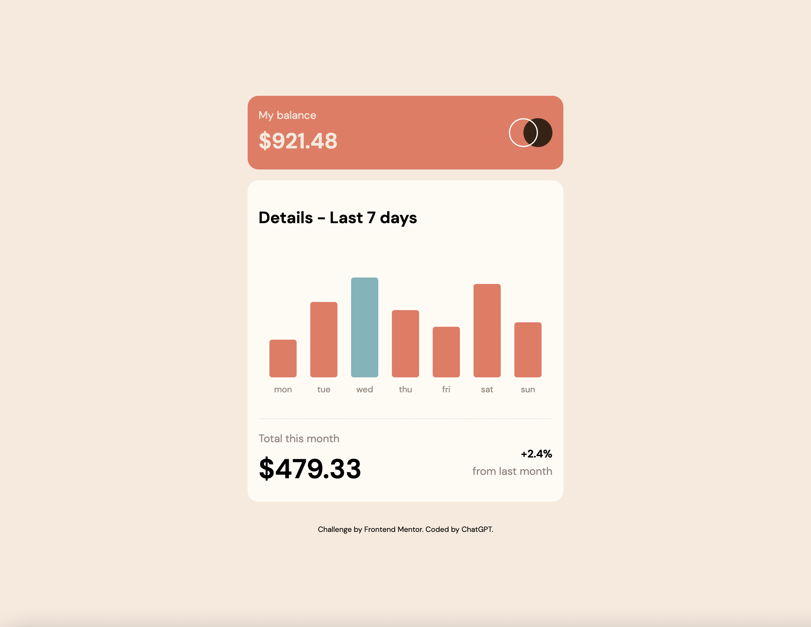
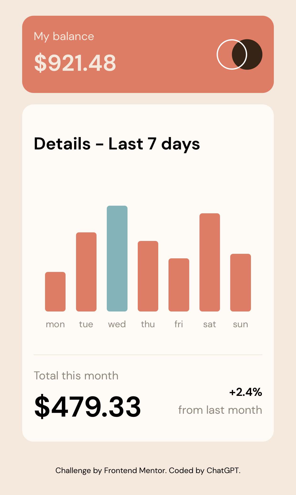

# Frontend Mentor - Expenses chart component solution

This is a solution to the [Expenses chart component challenge on Frontend Mentor](https://www.frontendmentor.io/challenges/expenses-chart-component-e7yJBUdjwt). Frontend Mentor challenges help you improve your coding skills by building realistic projects. 

## Table of contents

- [Overview](#overview)
  - [The challenge](#the-challenge)
  - [Screenshot](#screenshot)
  - [Links](#links)
- [My process](#my-process)
  - [Built with](#built-with)
  - [What I learned](#what-i-learned)
  - [Continued development](#continued-development)
  - [Useful resources](#useful-resources)
- [Author](#author)
- [Acknowledgments](#acknowledgments)

## Overview

### The challenge

Users should be able to:

- View the bar chart and hover over the individual bars to see the correct amounts for each day
- See the current day’s bar highlighted in a different colour to the other bars
- View the optimal layout for the content depending on their device’s screen size
- See hover states for all interactive elements on the page
- **Bonus**: Use the JSON data file provided to dynamically size the bars on the chart

### Screenshot




### Links

- Solution URL: [Expenses Chart Component Solution](https://github.com/satchitanand/004_Expenses_Chart_Component)
- Live Site URL: [Expenses Chart Component Site](https://satchitanand.github.io/004_Expenses_Chart_Component)

## My process

### Built with

- Semantic HTML5 markup
- CSS custom properties
- Flexbox
- Vanilla JavaScript
- Fetch API

### What I learned

During this project, I learned how to:

1. Fetch data from a JSON file using the Fetch API and create an HTML structure based on the fetched data.
1. Create a bar chart using HTML, CSS, and JavaScript.
1. Create a tooltip that appears when hovering over the bars in the chart and displays the corresponding data.
1. Center the contents of a container vertically within the browser window.

Here are some code snippets I'm proud of:

```html
<div class="chart"></div>
```
```css
.chart {
  display: flex;
  justify-content: space-between;
  align-items: flex-end;
  max-width: 100%;
  height: 100%;
}
```
```js
fetch("data.json")
  .then((response) => response.json())
  .then((data) => {
    createChart(data);
  })
  .catch((error) => {
    console.error("Error fetching data:", error);
  });
```

### Continued development

In future projects, I plan to continue refining my skills in:

- Fetching data from APIs and handling JSON data.
- Creating more complex data visualizations using JavaScript and CSS.
- Building responsive designs for various screen sizes.

#### In general

This is what was recommended for me when I asked ChatGPT the question.  I am amazed!

*JavaScript frameworks and libraries:* As I become more proficient in vanilla JavaScript, you might want to explore popular frameworks 
and libraries like React, Angular, or Vue.js. These tools can help you build more complex and feature-rich applications with better per
formance and maintainability.

*CSS preprocessors:* Learning CSS preprocessors like Sass or Less can help you write more organized and maintainable CSS code. These to
ols offer features like variables, mixins, and nesting that can make your stylesheets more modular and scalable.

*State management:* As your applications grow in complexity, managing application state becomes more challenging. Learning state manage
ment libraries like Redux or MobX for React applications, or Vuex for Vue.js applications, can help you manage state effectively and bu
ild more complex applications.

*Accessibility:* Understanding web accessibility best practices and techniques is essential to build inclusive web applications. Focus on learning how to make your applications accessible to a wider range of users, including those with disabilities.

*Performance optimization:* Learn about performance optimization techniques such as lazy-loading, code splitting, and caching to ensure that your applications load quickly and provide a smooth user experience.

*Testing:* Become familiar with testing tools and methodologies, like unit testing, integration testing, and end-to-end testing. Learning testing frameworks like Jest, Mocha, or Cypress can help you create more robust and reliable applications.

*Web APIs:* Deepen your knowledge of various web APIs, such as the Fetch API, Web Storage API, and Geolocation API. This can help you create more feature-rich and interactive applications.

*Version control:* If you haven't already, learn how to use a version control system like Git to better manage your code, collaborate with others, and track changes in your projects.

*Build tools and bundlers:* Familiarize yourself with build tools like Webpack, Parcel, or Rollup.js to automate tasks, bundle your assets, and optimize your application for production.

*Backend development:* As you become more comfortable with frontend development, you may want to explore backend development with technologies like Node.js, Express, or Django. Learning about databases, RESTful APIs, and server-side rendering can help you become a full-stack developer.

### Useful resources

- https://chat.openai.com/
- [MDN Web Docs](https://developer.mozilla.org/) - This resource is invaluable for understanding HTML, CSS, and JavaScript concepts.
- [CSS-Tricks](https://css-tricks.com/) - A great website for learning and keeping up with CSS techniques and best practices.
- [Frontend Mentor](https://www.frontendmentor.io/) - A platform that provides realistic coding challenges to help improve frontend skills.

## Author

- Website - [Anand Ramachandran](https://github.com/satchitanand)
- Frontend Mentor - [@satchitanand](https://www.frontendmentor.io/profile/satchitanand)

## Acknowledgments

I would like to thank the ChatGPT by OpenAI for providing valuable assistance and guidance throughout the development of this project.
